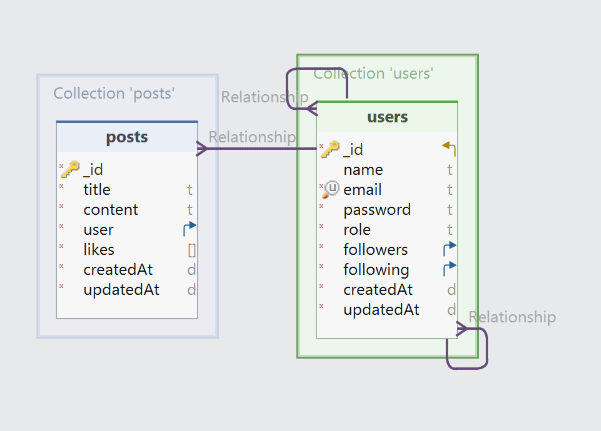

# Welcome to Tattoo Studio 🎨

 ## Table of Contents 🗂️
<details>
  <summary></summary>
  <ol>
    <li><a href="#about-the-project">About the project 📋</a></li>
    <li><a href="#getting-started">Getting started 🚀</a></li>
    <li><a href="#stack">Stack ⚓</a></li>
    <li><a href="#diagrama-bd">DB Diagram 📈</a></li>
    <li><a href="#endpoints">Endpoints 📌</a></li>
    <li><a href="#futuras-funcionalidades">Future features ⚙️</a></li>
    <li><a href="#contribuciones">Suggestions and contributions ❓</a></li>
    <li><a href="#licencia">License 🔑</a></li>
    <li><a href="#author">Author ✍️</a></li>
    <li><a href="#acknowledgments">Acknowledgments 🎓</a></li>
  </ol>
</details>

<div id="about-the-project"></div>

## About the project 📋
This is a Front End made for a fictitious tattoo Studio. This app contains views to login, register, view all users and delete as admin, view all services, the landing page and see, create and delete appointments. This is project made to start learning react and how to work between Frontend and Backend.

<div id="getting-started"></div>

## Getting Started (Local) 	🚀
1. Download this respository zip or use git clone repository.
2. Use the next command to install all the apps dependencies: ` $ npm install `
3. Then go to this respository and follow the steps. [Backend](https://github.com/guillermogm/TattooProject)
4. You can also change the port and the secret to encryct your passwords.
5. To start the servapper use `npm run dev` and to stop it use control c in the terminal.


<div id="stack"></div> 

## Stack ⚓
Tecnologies used:
<div align="center">
<a href=" https://www.mysql.com/">
    
</a>
<a href="https://www.expressjs.com/">
    
</a>
<a href="https://nodejs.org/es/">
    
</a>
<a href="https://www.typescriptlang.org/">
    
</a>
 </div>

<div id="diagrama-bd"></div>

## DB Diagram 	📈


<div id="endpoints"></div>

## Endpoints 📌
There is an export with all the endpoints in Thunderclient in the folder HTTP. In case you use another tecnology, all the endspoints are down here.

<div id="futuras-funcionalidades"> </div>

## Future features ⚙️
[ ] Add cascading deleting  
[ ] Collect all errors log in a file

<div id="contribuciones"></div>

## Suggestions and contributions ❓
Suggestions and contributions are always welcome.

You can do it in two different ways:

1. Create a github issue.
2. Create a fork of this repository
    - New branch 
        ```
        $ git checkout -b feature/userName-improvement
        ```
    - Commit with your changes 
        ```
        $ git commit -m 'feat: upgrade X feature'
        ```
    - Push the branch 
        ```
        $ git push origin feature/userName-improvement
        ```
    - Open a Pull Request.

<div id="licencia"></div>

## License 🔑
This project is licensed by guillermogm

 <div id="author"></div>

## Author ✍️
* Guillermo Gómez:
    * [GitHub](https://github.com/guillermogm)

<div id="acknowledgments"></div>

## Acknowledgements 🎓
* A shoutout to the teachers at Geekshubs Academy.